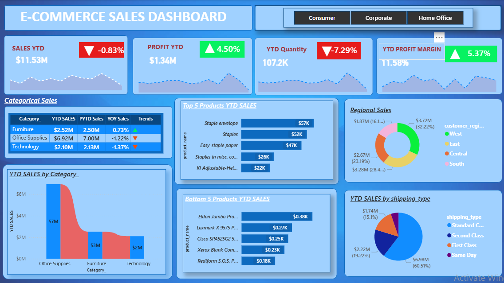

# 🛒 E-Commerce Sales Dashboard

## 📸 Dashboard Preview

## 📌 Overview
An interactive Power BI dashboard analyzing e-commerce performance 
across product categories, regions, and shipping types.

## 📊 Key Metrics
- Sales YTD: $11.53M
- Profit YTD: $1.34M | Profit Margin: 11.58%
- Total Quantity sold: 107.2K units

## 🔍 Key Insights
- Office Supplies leads category sales at $6.92M
- West region dominates with 32.22% of regional sales
- Standard Class is most used shipping method at 60.51%
- Top product: Staple Envelope at $57K

## 🛠️ Tools Used
Power BI | Excel | DAX
