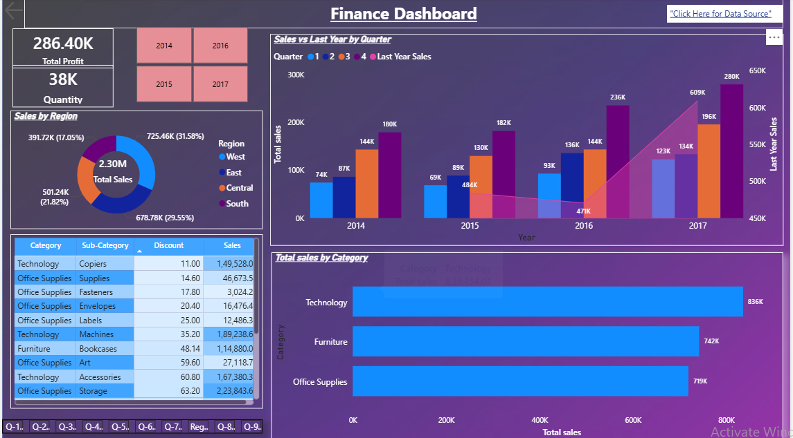

# 💰 Financial Analysis Dashboard

## 📸 Dashboard Preview

## 📌 Overview
An interactive Power BI dashboard analyzing financial performance 
across 3 regions, 5 stores, and multiple sales representatives 
with a total revenue of $127.41M.

## 📊 Key Metrics
- Total Revenue: $127.41M
- Average Revenue: $39.04K
- Total Transactions: 3,264
- Total Countries: 3,264

## 🔍 Key Insights
- Asia dominates regional sales at 61% of total revenue
- Q1 recorded highest revenue at $48M; Q3 was lowest at $17M
- Store 1 leads in store-wise revenue
- Smartphones drive the highest product category revenue
- Jansen B. is top sales rep with $1.37Cr in revenue

## 🛠️ Tools Used
Power BI | DAX | Excel

## 📂 Files Included
| File | Description |
|------|-------------|
| `Financial_Analysis_Dashboard.pbix` | Power BI dashboard file |
| `Finance_dataset.xlsx` | Raw dataset used |
| `Financial_Analysis_Dashboard_screenshot.png` | Dashboard preview |
